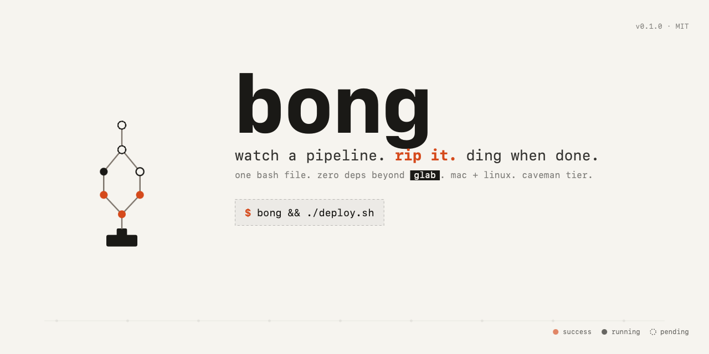

# bong

watch a pipeline. rip it. ding when done.

works with **gitlab pipelines** and **gitea actions** (auto-detected).

```
$ bong
14:02:11  watching pipeline #987654 (root status: running)
14:02:11  #987654 running   https://gitlab.com/foo/bar/-/pipelines/987654
14:03:42  #987654 → discovered downstream #987655  https://gitlab.com/foo/deploy/-/pipelines/987655
14:03:42  #987655 created   https://gitlab.com/foo/deploy/-/pipelines/987655
14:04:11  #987655 manual    https://gitlab.com/foo/deploy/-/pipelines/987655
                ↑ desktop notification fires here ("needs manual trigger")
14:06:31  #987655 running
14:08:01  #987654 success
14:08:11  #987655 success
14:08:11  ✓ done — success: #987654 #987655
                ↑ second notification fires here
```

one bash file. zero deps beyond `glab` (gitlab) or `curl` (gitea). mac + linux. caveman tier.

## install

prereq:

- **gitlab** — install [`glab`](https://gitlab.com/gitlab-org/cli) and log in once: `glab auth login`
- **gitea** — `curl` (already there) plus `GITEA_TOKEN` for private repos. host is auto-detected from your `origin` remote.

then drop `bong` somewhere on your `$PATH`:

```sh
sudo install -m 0755 bong /usr/local/bin/bong
```

(or just `chmod +x bong && cp bong ~/bin/` — whatever. it's one script.)

## use

```sh
bong                                                       # latest pipeline / run on current branch
bong 1234567                                               # by id (uses current repo for context)
bong https://gitlab.com/foo/bar/-/pipelines/1234567        # gitlab url — works from anywhere
bong https://codeberg.org/foo/bar/actions/runs/77          # gitea url — host comes from the url
```

what it does, every `BONG_POLL` seconds:

1. polls the pipeline / workflow run you pointed it at
2. **gitlab only:** discovers any downstream / triggered child pipelines via the `bridges` api and adds them to the watch
3. **gitlab only:** fires a desktop notification + bell on **any** pipeline hitting `manual` (it'll keep watching after you trigger it)
4. exits when everything is done. **`0`** if all ended `success`/`skipped`. **`1`** if any ended `failed`/`canceled`. final desktop notification + bell on the way out.

gitea actions has no `bridges`-equivalent and no `manual` gate, so on gitea bong watches just the one run.

so you can chain:

```sh
bong && ./deploy.sh
```

ctrl-c to stop watching at any time.

## config

env vars (also see `.env.example`):

| var             | default                   | what                                                            |
|-----------------|---------------------------|-----------------------------------------------------------------|
| `BONG_POLL`     | `10`                      | seconds between polls                                           |
| `BONG_PROVIDER` | _auto_                    | force `gitlab` or `gitea` (else inferred from url / git remote) |
| `GITEA_HOST`    | _from `origin` remote_    | gitea base url, e.g. `https://codeberg.org`                     |
| `GITEA_TOKEN`   | _none_                    | gitea api token; required for private repos                     |

provider is auto-detected: url shape wins (`/-/pipelines/` → gitlab, `/actions/runs/` → gitea), then your `origin` remote host (`gitlab*` / `codeberg.org` / `*gitea*`), else gitlab.

`glab` handles auth for gitlab. for gitea, set `GITEA_TOKEN` (you can scope it to read-only access on the repo).

## notifications

best to worst, bong tries each in turn:

- **mac**: [`terminal-notifier`](https://github.com/julienXX/terminal-notifier) → `osascript` (built-in)
- **linux**: `notify-send` (libnotify; usually preinstalled with most desktops)
- **fallback**: terminal bell (`\a`)

if you're on a headless box, the bell is all you'll get — that's fine, exit code still works for `bong && deploy`.

## how it works (briefly)

- pipeline tree state lives in parallel bash arrays keyed by globally-unique run id; we map id → project (numeric for gitlab, `owner/repo` for gitea) so cross-project downstreams (gitlab) just work.
- json parsing is `grep`/`sed` — no `jq` dep. only the few fields we need (`id`, `project_id`, `status`, `web_url`/`html_url`).
- gitea statuses (`failure`/`cancelled`/`in_progress`/`waiting`/`queued`) are normalized to gitlab vocabulary (`failed`/`canceled`/`running`/`pending`) so the main loop stays provider-agnostic.
- `manual` is treated as "stuck waiting on a human" — notify once, keep polling. only `success`/`failed`/`canceled`/`skipped` are terminal for exit.
- gitlab path uses `glab api`; gitea path uses `curl` against `/api/v1/repos/{owner}/{repo}/actions/runs[/{id}]`. json shape is stabler than either cli's pretty-printing.
